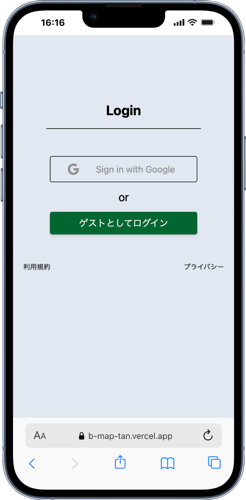
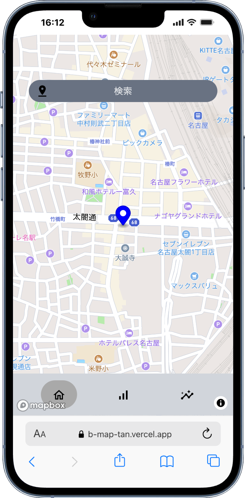
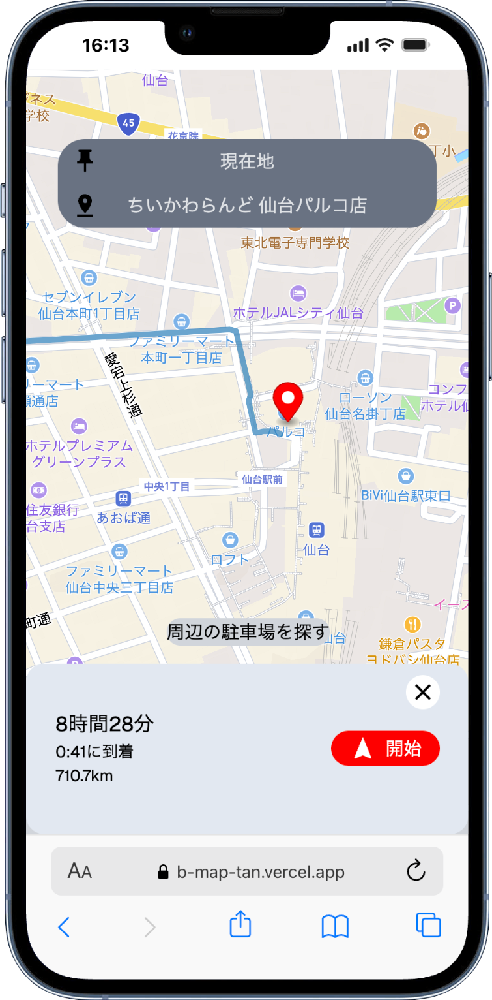
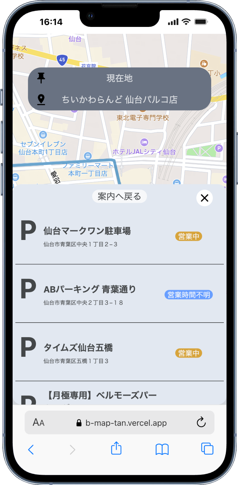
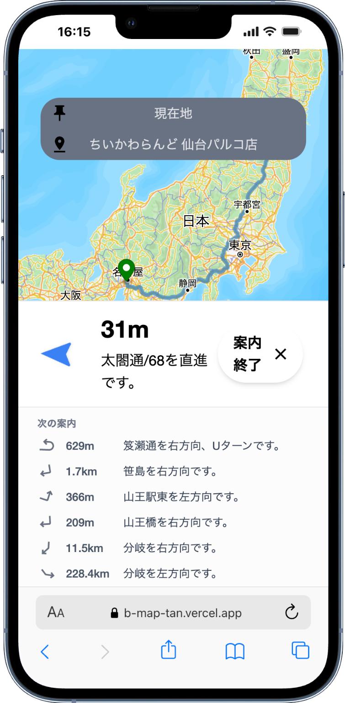
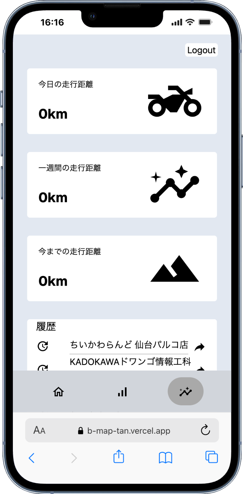
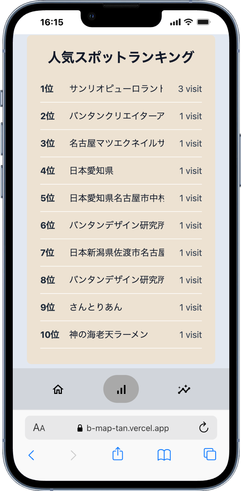

# b-map
バイカーのためのナビゲーションアプリ
## チームメンバー
- <a href="https://github.com/Takuya0202">Takuya0202(プロジェクトリーダー、アプリ開発全般、プレゼン資料作成)</a>
- <a href="https://github.com/yuge0915">yuge0915(webデザイン、フロントエンド、プレゼン資料作成)</a>
- <a href="https://github.com/user20040316">user20040316(フロントエンド、mapbox 呼び出し、プレゼン資料作成)</a>
- <a href="https://github.com/iwaki0710">iwaki0710(フロントエンド、google places呼び出し)</a>
- <a href="https://github.com/sametyoko">sametyoko(フロントエンド)</a>
- <a href="https://github.com/tikuwa0725-create">tikuwa0715-create</a>

## 制作背景
2025年10月 ~ 11月中旬にかけて、学校の授業の一環として、チーム制作に取り掛かりました。 
外部apiを2つ以上使用することが条件としてアプリの考案から開発、プレゼンまでいたしました。 

## 制作物url
[こちらをクリック。スマホメインのレスポンシブ](https://b-map-tan.vercel.app) 
[プレゼンスライド](https://drive.google.com/file/d/1lZQgSXY2TKezIxPRknwMVCOu6vpfLmxs/view?usp=sharing) 

## 技術スタック

## アプリ画面・機能

### 1. ログインページ

#### 機能
- **Googleログイン**
  - Google OAuth認証によるログイン機能
  - supabase authを利用
- **利用規約・プライバシーポリシー表示**
  - アプリの利用規約とプライバシーポリシーの確認

#### 役割
- googleログイン機能(takuya0202)
- UI画面コーディング(sametyoko)
- デザイン考案・実装(yuge0915)

---

### 2. TOPページ（ナビゲーション）

#### 機能
- **出発地・目的地検索**
  - Mapbox API(search box api)を使用した地点検索機能
  - 現在地の自動取得
- **地図表示**
  - Mapboxによるインタラクティブな地図表示
- **ナビゲーション機能**
  - ルート案内機能(direction api)
  - 経路表示
- **検索履歴表示**
  - 過去に検索した場所の履歴表示
  - cookie保存で未ログインでも30日まで表示
- **目的地周辺の駐車場表示**
  - google placesで取得
  - 営業中かどうか表示

#### 役割
- 地図表示(user20040316)
- 駐車場のUIコーディング(user20040316)
- 目的地サジェスト機能・UI(user20040316)
- ナビゲーション機能・UI(takuya0202)
- 検索履歴機能(takuya0202)
- 駐車場取得機能(iwaki0710)
- デザイン考案・実装(yuge0915)

---

### 3. ダッシュボードページ

#### 機能
- **走行距離統計**
  - 今日の走行距離表示
  - 一週間の走行距離表示
  - 今までの総走行距離表示
- **ナビゲーション履歴**
  - 過去に訪れた場所の履歴表示
- **ログアウト機能**

#### 役割
- ユーザーデータ返却バックエンド(takuya0202)
- ログアウト機能(takuya0202)
- UI画面コーディング(yuge0915)
- デザイン考案・実装(yuge0915)

---

### 4. スポットページ

#### 機能
- **人気スポットランキング**
  - Google Places APIを使用した人気スポットの表示
  - 訪問回数（visit数）によるランキング表示

#### 役割
- UI画面コーディング(iwaki0710)
- ランキング機能(takuya0202)
- デザイン考案・実装(yuge0915)

### その他
- ソースコード管理・DB構築・デプロイ(takuya0202)
- デバック(user20040316,yuge0915)

### 制作上の工夫点
#### できる限りのナビゲーション
  15秒おきに現在地を取得し、変更があった場合、非同期でデータフェッチを行い、ルート・マップの更新を行った点
#### ログインを必須としない構成
  cookieに検索履歴を保存することで、未認証のユーザーでも30日間履歴を利用可能。 
  また、地図の案内機能にもログインを必須としないことで、ほとんどの機能を使えるように
#### 型安全性の確保
  TypeScriptとPrismaを活用し、コンパイル時にエラーを検出できる型安全な設計
#### ユーザー体験の向上
  - Suspenseを使ったローディングスケルトンの実装
  - react-hot-toastによる直感的なエラー通知
  - Mapbox日本語化対応で日本のユーザーに最適化
  - 駐車場の営業状態を色分け表示（営業中/営業終了/不明）
#### 開発環境の整備
  Docker・makefileによる環境構築の簡易化、チーム開発の効率化

### できなかったこと、振り返り
#### 技術選定の課題
  ナビゲーション機能はネイティブアプリの方が適しており、Webアプリケーションでは位置情報の精度やバックグラウンド動作に制約があった
#### 雨雲レーダー付き地図表示
  Mapboxのjapan weather layerを使って気象情報のレイヤーを表示する機能を実装しようとしたが、 
  技術的な問題により実現できず断念
#### データベース設計の改善点
  人気スポットランキングの訪問回数を効率的に集計するため、より最適化されたインデックス設計が必要だった
